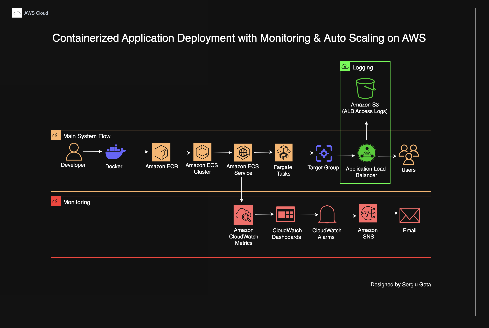

# Containerized Application Deployment with Observability & Auto Scaling on AWS

## Overview

This project demonstrates how to deploy a **containerized web application on AWS using Amazon ECS Fargate** while implementing **monitoring, logging, alerting, and auto scaling**.

A simple web application is packaged into a **Docker container**, pushed to **Amazon ECR**, and deployed to **Amazon ECS Fargate** behind an **Application Load Balancer**.

The system includes full **observability using Amazon CloudWatch dashboards, metrics, and alarms**, with notifications sent through **Amazon SNS**.

Application Load Balancer logs are stored in **Amazon S3** for auditing and monitoring purposes.

This project simulates a **production-style container deployment architecture** used by modern cloud engineering teams.

---

## Architecture

The application infrastructure follows this architecture:

Developer → Docker Build → Amazon ECR → Amazon ECS Cluster → ECS Service → Fargate Tasks → Target Group → Application Load Balancer → End Users

Monitoring and alerting flow:

ECS Service → CloudWatch Metrics → CloudWatch Dashboard → CloudWatch Alarms → Amazon SNS → Email Notifications

Logging flow:

Application Load Balancer → Amazon S3 (ALB Access Logs)

AWS resources are deployed in the **eu-central-1 region**.

---

## Architecture Diagram



---

## Technologies Used

AWS ECS Fargate  
AWS ECR  
AWS Application Load Balancer  
AWS CloudWatch  
AWS SNS  
AWS S3  
Docker  
Linux  
Git  

---

## Project Structure

```
aws-ecs-observability-autoscaling
│
├── architecture
│   └── 14-architecture-diagram.png
│
├── app
│   ├── Dockerfile
│   └── index.html
│
├── screenshots
│   ├── 1-docker-image-built.png
│   ├── 2-ecr-repository-image.png
│   ├── 3-ecs-cluster-overview.png
│   ├── 4-ecs-task-definition.png
│   ├── 5-ecs-service-running.png
│   ├── 6-alb-overview.png
│   ├── 7-target-group-healthy.png
│   ├── 8-application-running-browser.png
│   ├── 9-cloudwatch-dashboard.png
│   ├── 10-cloudwatch-alarm.png
│   ├── 11-sns-topic.png
│   ├── 12-ecs-auto-scaling-policy.png
│   └── 13-s3-alb-access-logs.png
│
├── README.md
└── LICENSE
```

---

## Deployment Workflow

The application deployment follows these steps:

1. The application is containerized using Docker  
2. The Docker image is pushed to Amazon ECR  
3. An ECS task definition references the container image  
4. An ECS service launches tasks on AWS Fargate  
5. The service registers tasks with a target group  
6. The Application Load Balancer routes traffic to the tasks  
7. End users access the application through the ALB public endpoint  

Monitoring workflow:

1. ECS publishes metrics to CloudWatch  
2. CloudWatch dashboards visualize system performance  
3. CloudWatch alarms monitor defined thresholds  
4. SNS sends notifications when alarms trigger  

Logging workflow:

Application Load Balancer → S3 bucket → stored access logs

---

## Application Deployment

The application runs inside an **Amazon ECS Fargate service** behind an **Application Load Balancer**.

The ALB distributes incoming HTTP traffic across running container tasks.

The service automatically scales based on **CPU utilization using ECS Service Auto Scaling policies**.

---

## Screenshots

### Docker Image Build


---

### Docker Image Stored in Amazon ECR


---

### ECS Cluster


---

### ECS Task Definition


---

### ECS Service Running


---

### Application Load Balancer


---

### Target Group Healthy


---

### Live Application via Application Load Balancer


---

### CloudWatch Monitoring Dashboard


---

### CloudWatch Alarm


---

### SNS Topic for Notifications


---

### ECS Service Auto Scaling Policy


---

### ALB Access Logs Stored in Amazon S3


---

## Key Concepts Demonstrated

Containerization with Docker  
Container registry using Amazon ECR  
Container orchestration using Amazon ECS Fargate  
Load balancing with Application Load Balancer  
Infrastructure monitoring using Amazon CloudWatch  
Alerting with CloudWatch Alarms  
Notification systems using Amazon SNS  
Application auto scaling using ECS Service Auto Scaling  
Centralized logging using Amazon S3  

---

## Learning Outcomes

Through this project I practiced:

Building containerized applications with Docker  
Deploying containers to ECS Fargate  
Designing scalable services behind load balancers  
Implementing monitoring dashboards using CloudWatch  
Creating alerting systems using CloudWatch Alarms and SNS  
Configuring ECS auto scaling policies  
Storing infrastructure logs in Amazon S3  

---

## Challenges Encountered and Solutions

During the development of this project several issues occurred while configuring AWS services. Troubleshooting these problems helped strengthen my understanding of containerized deployments on AWS.

### ECS Tasks Failing to Start

Problem  
ECS tasks initially failed to start.

Cause  
The container image URI in the ECS task definition did not correctly reference the Amazon ECR repository.

Solution  
Updated the task definition to reference the correct ECR image URI:

```
<account-id>.dkr.ecr.eu-central-1.amazonaws.com/observability-app:latest
```

After creating a new task definition revision, the ECS service successfully launched the container.

---

### Target Group Health Checks Failing

Problem  
The Application Load Balancer target group reported tasks as unhealthy.

Cause  
The container port configuration did not match the target group port.

Solution  

Verified the following configurations:

Container port mapping in ECS task definition  
Target group port configuration  
ECS service load balancer settings  

Once the container exposed **port 80**, the target group health checks passed.

---

### CloudWatch Metrics Not Appearing

Problem  
Initially the CloudWatch dashboard showed no metrics.

Cause  
Metrics were not generated because there was little traffic to the application.

Solution  

Generated traffic manually by refreshing the ALB endpoint several times.  

This produced metrics such as:

RequestCount  
TargetResponseTime  
CPUUtilization  

These metrics then appeared in the dashboard.

---

### ECS Auto Scaling Not Triggering

Problem  
Auto scaling did not activate during testing.

Cause  
CPU utilization never reached the defined threshold.

Solution  

Temporarily reduced the scaling threshold and generated traffic to simulate load.  

This confirmed the auto scaling configuration worked correctly.

---

### SNS Email Notification Not Received

Problem  
CloudWatch alarms triggered but email notifications were not received.

Cause  
The SNS email subscription had not been confirmed.

Solution  

Confirmed the SNS subscription through the verification email sent by AWS.  

After confirmation, alarm notifications were successfully delivered.

---

## Lessons Learned

These troubleshooting steps reinforced several important cloud engineering practices:

Always verify container image URIs when using ECR  
Ensure container ports match load balancer target ports  
Generate traffic when testing monitoring dashboards  
Validate alarm thresholds during auto scaling testing  
Confirm SNS subscriptions before testing notifications  

---

## Author

Sergiu Gota  

AWS Cloud Engineer 

GitHub  
https://github.com/sergiugotacloud
````
