# Containerized Application Deployment with Monitoring & Auto Scaling on AWS

This project demonstrates how to deploy a containerized application on AWS using ECS Fargate with monitoring, alerting and auto scaling.

## Architecture

## Application Flow

User  
→ Application Load Balancer  
→ Target Group  
→ ECS Service  
→ Fargate Task  
→ Docker Container  

## Monitoring Flow

ECS Service  
→ CloudWatch Metrics  
→ CloudWatch Alarms  
→ SNS  
→ Email  

## Logging Flow

Application Load Balancer  
→ S3 Bucket (ALB Access Logs)

## Services Used

Amazon ECS (Fargate)  
Amazon ECR  
Application Load Balancer  
Amazon CloudWatch  
Amazon SNS  
Amazon S3  
Docker

## Screenshots

Docker Image Build

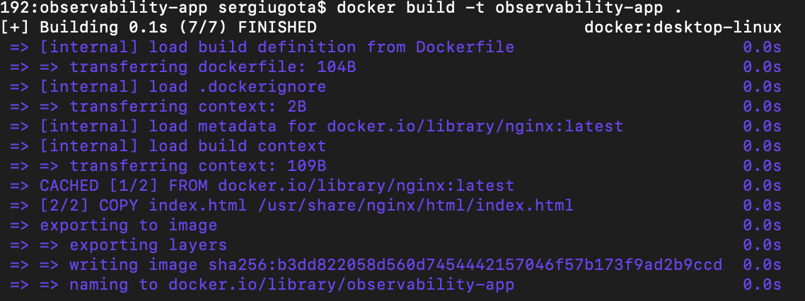

ECR Repository

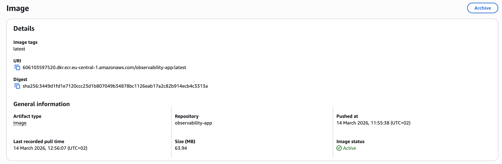

ECS Cluster

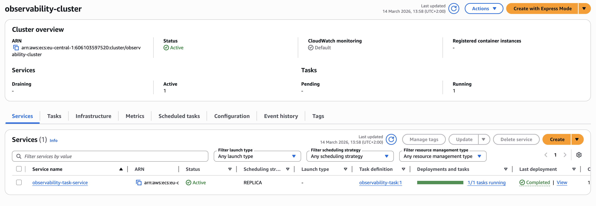

ECS Task Definition

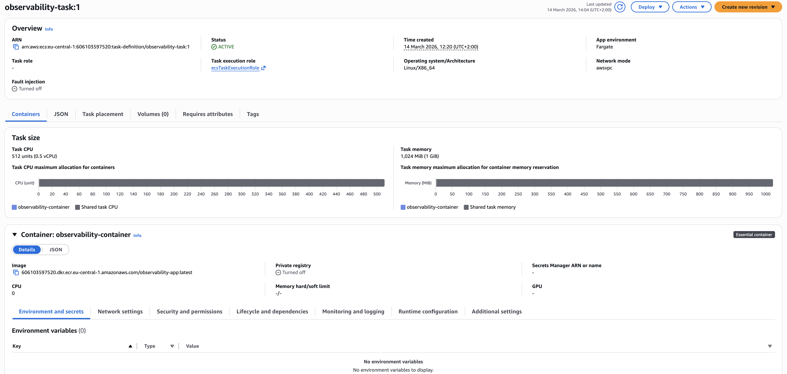

Running ECS Service

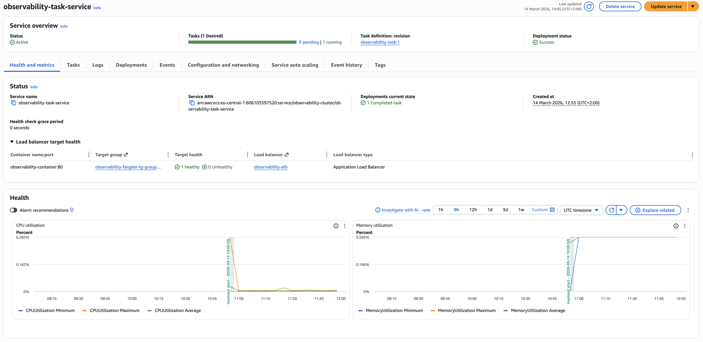

Application Load Balancer

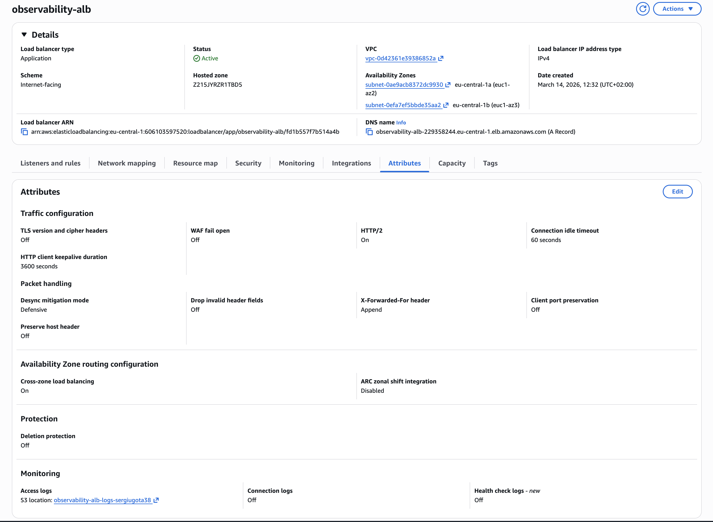

Target Group Healthy

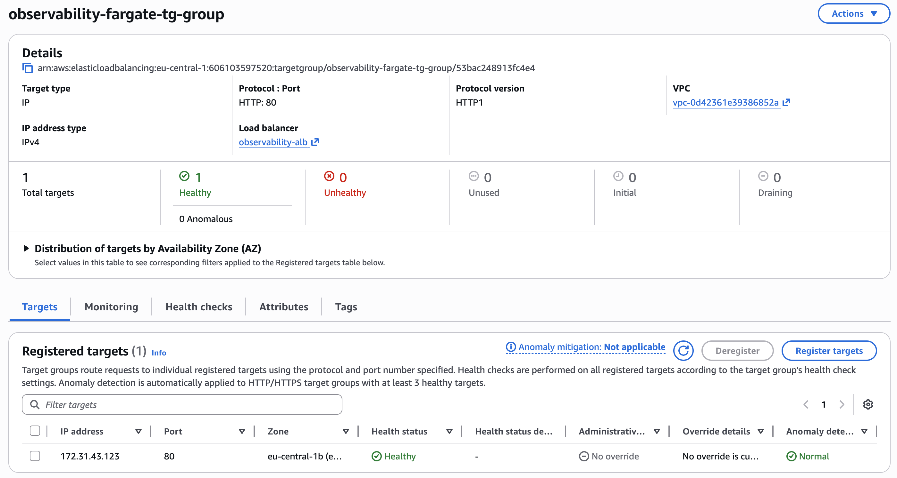

Application Running

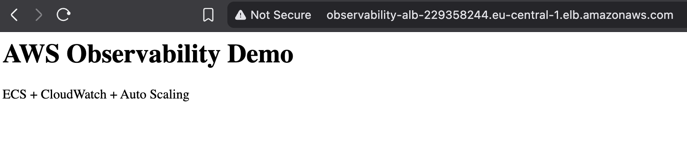

CloudWatch Dashboard

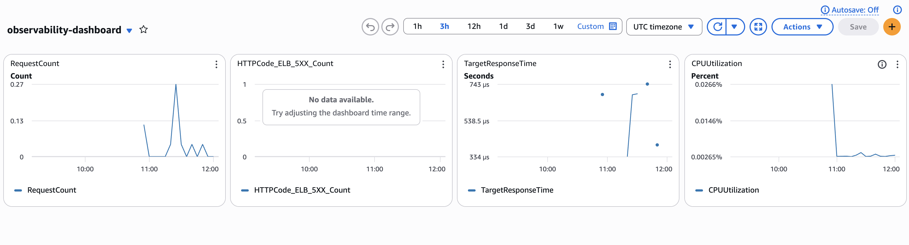

CloudWatch Alarm

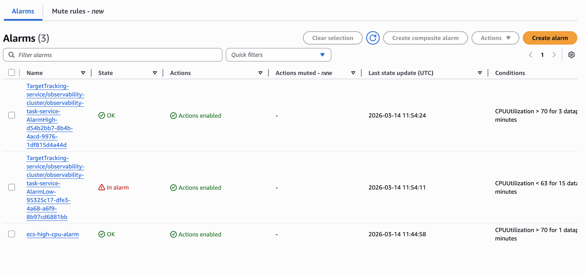

SNS Topic

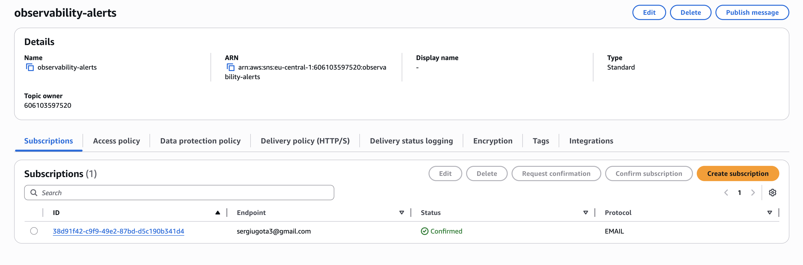

Auto Scaling Policy

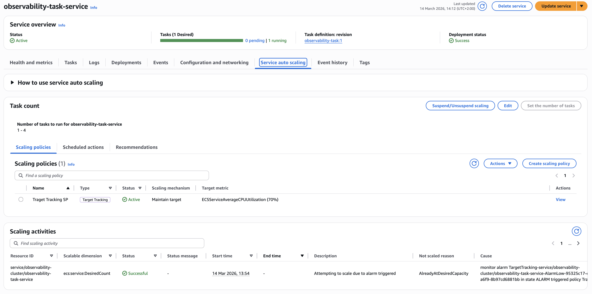

ALB Logs in S3

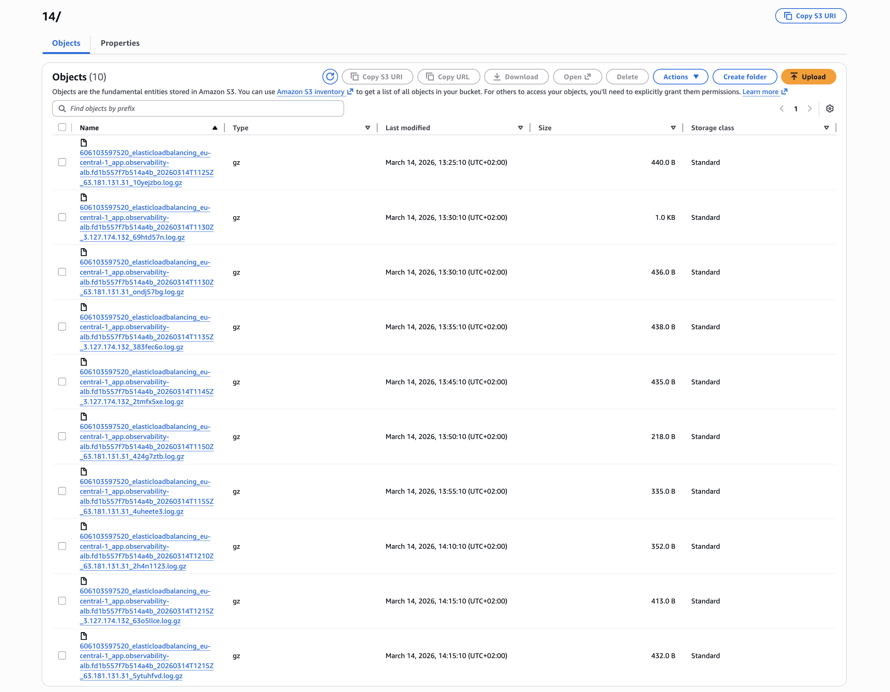

## Things I learned while building this

Containerizing applications using Docker  
Running containers with ECS Fargate  
Implementing load balancing using ALB  
Monitoring infrastructure using CloudWatch  
Sending alerts using SNS  
Configuring ECS Auto Scaling  
Storing ALB logs in Amazon S3
